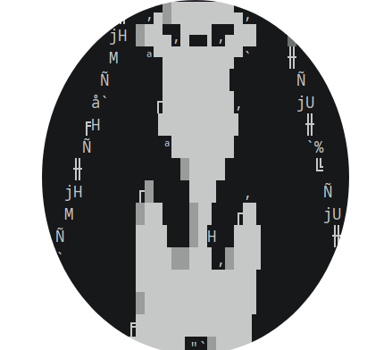
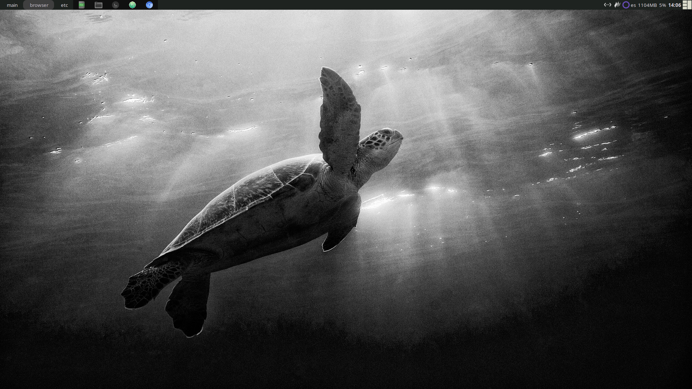
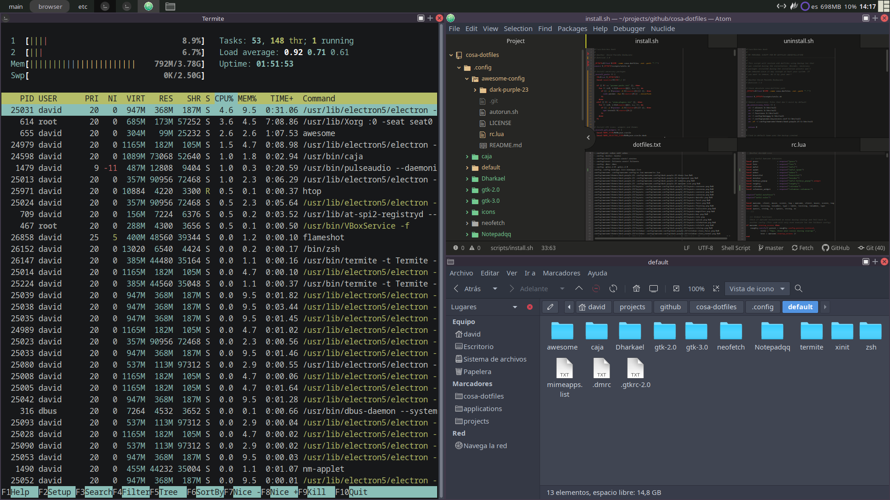
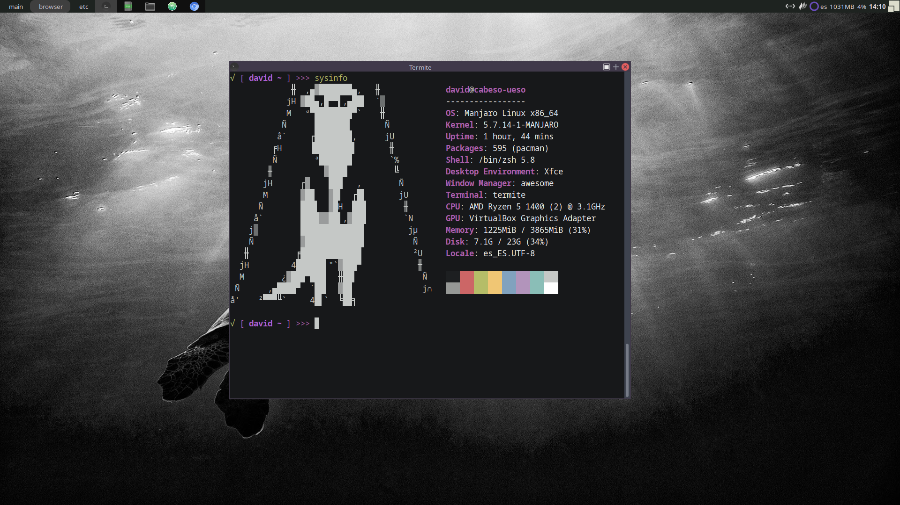

# AWESOME CONFIGURATION

<a name="screenshots"></a>
## Screenshots





## Installation

```bash
git clone https://github.com/losedavidpb/awesome-config

cd <AWESOME-CONFIGURATION-PATH>
./install.sh
```
